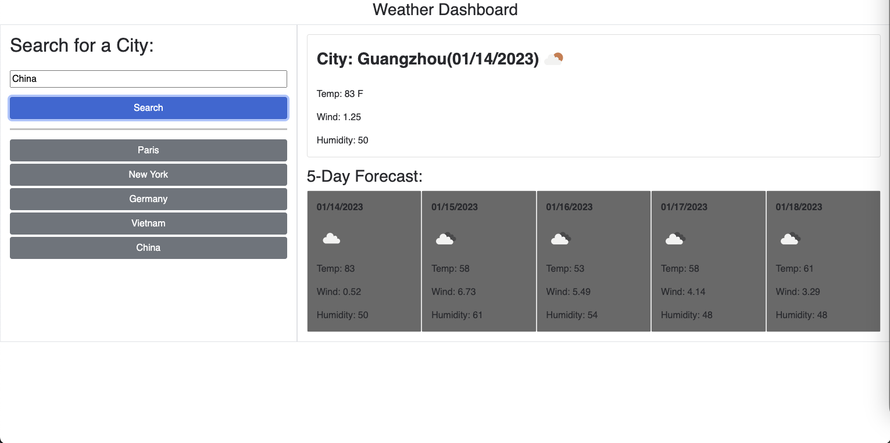

# Homework 06: Weather Dashboard

## Description

A simple Weather Dashboard using free Third-party API (openweathermap.org) to get current weather and 5-day forecast of spcific city, showing temprature, wind, humidity and weather icon

## Links

- Here is the link to access simple weather dashboard: [Weather dashboard](https://christopher211.github.io/5day-weather/)

- The repo of the weather app: [Source Code](https://github.com/christopher211/5day-weather)

## User Story

```
AS A traveler
I WANT to see the weather outlook for multiple cities
SO THAT I can plan a trip accordingly
```

## Acceptance Criteria

```
GIVEN a weather dashboard with form inputs
WHEN I search for a city
THEN I am presented with current and future conditions for that city and that city is added to the search history
WHEN I view current weather conditions for that city
THEN I am presented with the city name, the date, an icon representation of weather conditions, the temperature, the humidity, and the wind speed
WHEN I view future weather conditions for that city
THEN I am presented with a 5-day forecast that displays the date, an icon representation of weather conditions, the temperature, the wind speed, and the humidity
WHEN I click on a city in the search history
THEN I am again presented with current and future conditions for that city
```

## Screenshot preview

The following image shows the web application's appearance and functionality:


